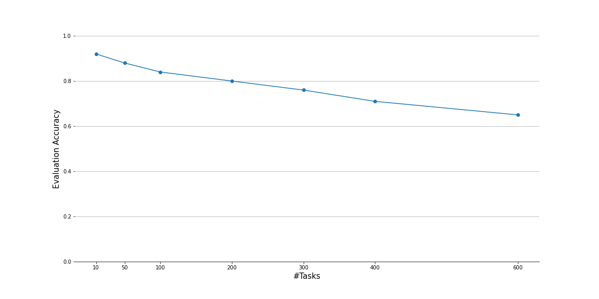

PyTorch implementation of the "ANML" algorithm ([paper](https://arxiv.org/abs/2002.09571),
[code](https://github.com/uvm-neurobotics-lab/ANML)) using the [higher](https://github.com/facebookresearch/higher)
framework.

# Overview

The "training" of a few-shots meta-learned model like ANML consists of:
- train-train: the model is shown a random (initially new) task, i.e. 20 chars from one Omniglot class (a.k.a. learning phase)
- train-test: the model is tested on the last task it has just trained on and a sample of 64 random images from all the classes (a.k.a. remembering phase)
- test-train: at test time the model is shown a few examples (15) of a new class not seen during train-train. Labels are also provided and the model is asked to quickly learn this new class without forgetting (for 600 the learning sequence is 9000 gradient updates long)
- test-test: after learning from the few-shots the model performance is evaluated on the holdout examples.

The code for these phases can be found inside [this](anml.py) file.

# Prerequisites

- Python >=3.5 
- PyTorch >=1.6.0
- [higher](https://github.com/facebookresearch/higher)
- numpy
- scikit-learn
- tqdm

## Creating Your Virtual Environment

To get you set up faster, we support creating a Python environment directly from dependency files.

### Conda

If you have Anaconda or Miniconda, navigate to the `higherANML` repo and run:
```shell
$  conda env create -n higherANML -f environment.yml
$  conda activate higherANML
```
If you want to name the environment differently, replace `higherANML` in the above lines with your custom name.

This file can be re-generated by: (1) running `conda env export --from-history > environment.yml`, (2) manually deleting
the `prefix:` field, (3) adding the necessary `pip` packages.

### Pip

To use classic Python tooling, navigate to the `higherANML` repo and run:
```shell
$  python -m venv .venv
$  source .venv/bin/activate
$  pip install -r requirements.txt
```
This assumes you want to store the virtual environment locally within the repo, as is common practice with `venv`. If
you have errors and do not have the latest pip, try upgrading to see if that fixes the issue: `python -m pip install
--upgrade pip`.

This file should be manually kept in sync when new dependencies are added.

### Pipenv

We do not currently support `pipenv` because this author could not get it to install PyTorch correctly.
But if you get a working `Pipfile` please do contribute!

# Training

Phase       | Trained    |  Optimizer  | LR
 ---------- | ---------  | ----------  | -----
 inner loop | rln + fc   | SGD         | 0.1
 outer loop | everything | Adam        | 0.003

Training can be performed using

```
python train_omni.py
``` 
flags can be provided for exploring different setups.

# Evaluation


Number of tasks | Accuracy | Eval LR
----| ---- | ------- 
10  | 0.90 | 0.0010 
50  | 0.89 | 0.0010
75  | 0.86 | 0.0010 
100 | 0.85 | 0.0010 
200 | 0.80 | 0.0008 
300 | 0.76 | 0.0008 
400 | 0.72 | 0.0008 
600 | 0.65 | 0.0008

Evaluation can be performed using

```bash
python eval_omni.py --model trained_anmls/256_112_2304_ANML-29999.pth --classes 10 --lr 0.00085 --runs 10
```

During evaluation the model is quite sensitive to learning rates used, the data shown in the above table has been gathered sweeping several learning rates over multiple repeats.


# End-to-End Pipeline

If you have access to a Slurm cluster, and you are using
[Neuromanager](https://github.com/lfrati/neuromanager), then everything from train to
test can be automated in a single pipeline. **Be sure to use the
[launcher-improvements](https://github.com/lfrati/neuromanager/tree/ntraft/launcher-improvements) branch
of Neuromanager.**

Here is an example command to train and test a model:
```
python launch_train.py -c configs/train-omni-sanml.yml --project my-wandb-project
```

Everything about the training and evaluation is defined by this single config file, `configs/train-omni-sanml.yml`
(which also references other config files). You should see output like this when launching:
```
wandb: Currently logged in as: ntraft (use `wandb login --relogin` to force relogin)
wandb: wandb version 0.12.17 is available!  To upgrade, please run:
wandb:  $ pip install wandb --upgrade
wandb: Tracking run with wandb version 0.12.10
wandb: Syncing run whole-shadow-15297
wandb: ⭐️ View project at https://wandb.ai/ntraft/anml-sanml-oml
wandb: 🚀 View run at https://wandb.ai/ntraft/anml-sanml-oml/runs/29ox9s3q
wandb: Run data is saved locally in /gpfs2/scratch/ntraft/Development/higherANML/wandb/run-20220527_142930-29ox9s3q
wandb: Run `wandb offline` to turn off syncing.

Running command: launcher dggpu /gpfs2/scratch/ntraft/Development/higherANML/train_anml.py --config /gpfs2/scratch/ntraft/Development/higherANML/experiments/anml-sanml-oml/whole-shadow-15297/train-config.yml
Submitted batch job 533897

wandb: Waiting for W&B process to finish, PID 71284... (success).
wandb:                                                                                
wandb: Synced 6 W&B file(s), 0 media file(s), 0 artifact file(s) and 0 other file(s)
wandb: Synced whole-shadow-15297: https://wandb.ai/ntraft/anml-sanml-oml/runs/29ox9s3q
wandb: Find logs at: /gpfs2/scratch/ntraft/Development/higherANML/wandb/run-20220527_142930-29ox9s3q/logs/debug.log
wandb: 
```

Once launched, you can alter any piece of the config (or the code!) and launch another.

Each run will create its own folder in `higherANML/experiments/<project-name>/<group-name>`, and all configs and results
will be logged under this group name (in the above case, `whole-shadow-15297`).

### Using BlackDiamond

By default this runs everything on DeepGreen (`dggpu` profile in Neuromanager), but you can run on BlackDiamond instead
by adding `--cluster bdgpu`. However, in this case you'll need to have a `deep-amd` conda environment, where you need to
install PyTorch with AMD tooling instead of CUDA tooling. You should be able to do this just by cloning a working
environment and reinstalling PyTorch following AMD instructions instead. You will also need to add the following to your
`.bash_profile` (or equivalent shell config), or else you will encounter import or library linkage errors:
```shell
# This variable is set on BlackDiamond, which means on that cluster we look in
# the wrong place for certain libraries. So we need to manually add to the path
# to make sure things still work.
if [ -n $LD_LIBRARY_PATH ]; then
    export LD_LIBRARY_PATH=$LD_LIBRARY_PATH:/users/n/t/ntraft/miniconda3/lib
fi
```
Replace `/users/n/t/ntraft/miniconda3` with your own conda install location.
